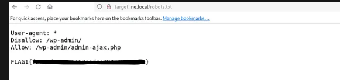
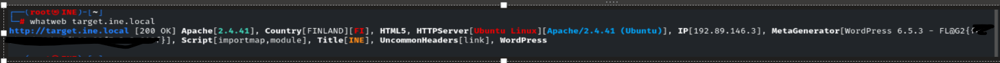
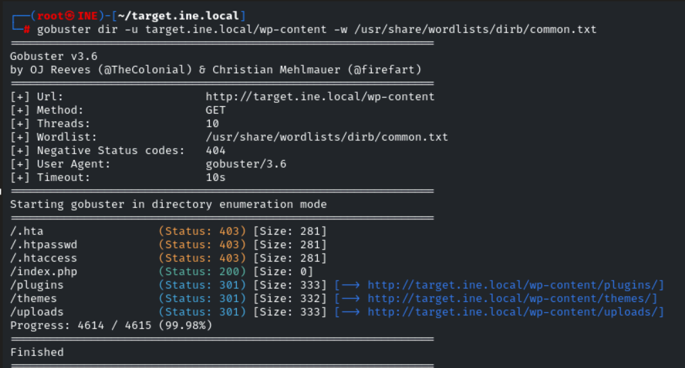
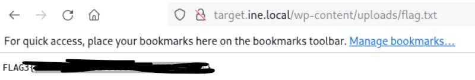
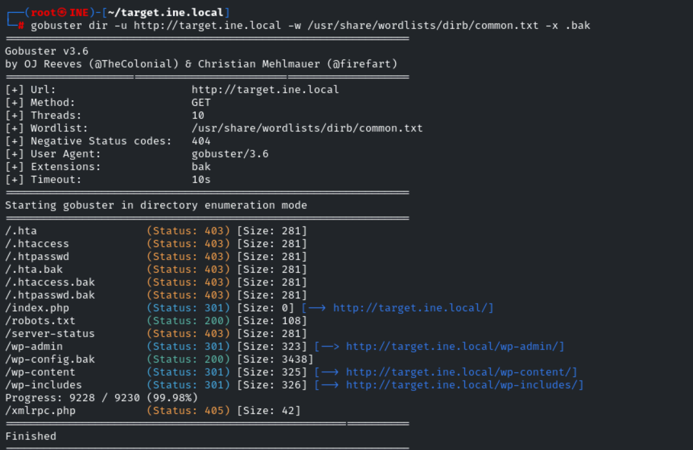
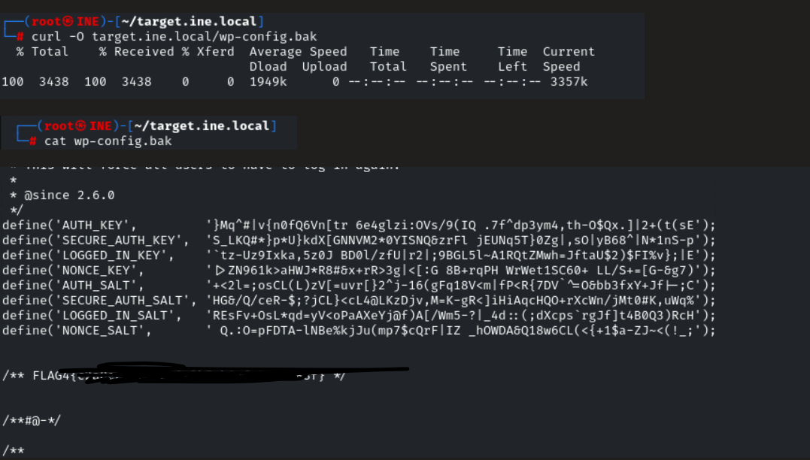
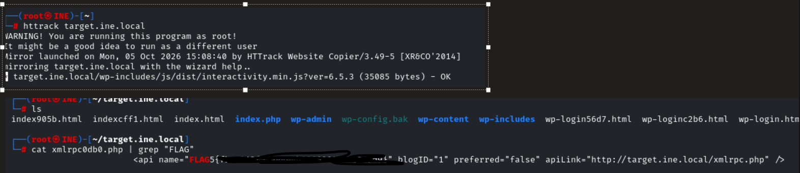

# Assessment Methodologies: Information Gathering — CTF 1

## Overview

This write-up documents my approach to the **Information Gathering CTF 1** from the INE/eJPT learning path.

The objective of this exercise was to practice reconnaissance and information-gathering techniques and understand how the information discovered during reconnaissance can support further security investigation.

---

## Methodology

The general approach used during this assessment was:

1. Identify publicly accessible information.
2. Enumerate the target for additional resources and technologies.
3. Investigate interesting findings.
4. Validate the information discovered.
5. Assess the potential security impact.
6. Document the findings and recommended security improvements.

---

# Flag 1 — robots.txt

## Objective

Identify information disclosed through the website's `robots.txt` file.

## Enumeration

The first step was to check whether the target exposed a `robots.txt` file.

```bash
curl http://target.ine.local/robots.txt
```

## Observation

The `robots.txt` file contained paths that provided additional information about the website.



## Analysis

The `robots.txt` file is primarily used to provide crawling instructions to search engine bots.

However, `robots.txt` **does not provide access control**. Paths listed as disallowed may still be directly accessible to users or attackers.

The discovered paths therefore provided useful leads for further enumeration.

## Security Finding

**Information Disclosure through `robots.txt`**

## Security Impact

An attacker can use the information in `robots.txt` to identify potentially interesting directories or resources that may otherwise be difficult to discover.

## Recommendation

Sensitive resources should not be protected using `robots.txt`.

Access to sensitive resources should instead be controlled using proper authentication and authorization mechanisms.

---

# Flag 2 — Web Technology Identification

## Objective

Identify the web application technology and version running on the target.

## Enumeration

I used WhatWeb to fingerprint the technologies used by the web server.

```bash
whatweb http://target.ine.local
```

## Observation

WhatWeb identified the target as running **WordPress 6.5.3**.



## Analysis

Identifying the web application and version provides useful information for further security assessment.

An attacker could use the identified version to research known vulnerabilities, available exploits, and security advisories associated with that version.

However, **version disclosure alone does not confirm that the application is vulnerable**. Additional investigation would be required to identify vulnerable plugins, themes, configurations, or applicable vulnerabilities.

## Security Finding

**Web Technology / Version Disclosure**

## Security Impact

Technology fingerprinting provides an attacker with information that can assist with reconnaissance and vulnerability research.

## Recommendation

Keep WordPress, plugins, themes, and other application components updated.

Where practical, unnecessary technology and version information should also be minimized.

---

# Flag 3 — Web Directory Enumeration

## Objective

Identify directories and files that may not be directly linked from the main website.

## Enumeration

I used Gobuster to perform directory and file enumeration.

```bash
gobuster dir -u http://target.ine.local/wp-content -w /usr/share/wordlists/dirb/common.txt
```

## Observation

The enumeration identified several accessible resources.



One of the discovered resources was particularly interesting and required further investigation.

## Analysis

Directory enumeration can reveal resources that are not linked from the application's main pages.

These resources may include:

* Administrative interfaces
* Backup files
* Configuration files
* Development resources
* Old application files
* Sensitive documents

The discovery itself does not necessarily represent a vulnerability. The security impact depends on what information or functionality is exposed.

## Security Finding

**Exposed Web Resources**

## Security Impact

Unexpectedly accessible resources may provide additional information that can assist an attacker during reconnaissance or subsequent attacks.


## Recommendation

Review publicly accessible directories and files and remove resources that are not required.

Directory listing should also be disabled where it is not necessary.

---

# Flag 4 — Exposed Backup File

## Objective

Investigate an interesting file discovered during web enumeration.

## Enumeration

The previous directory enumeration identified a potentially interesting backup file.

The file was accessed and its contents were reviewed to determine whether it contained useful or sensitive information.

```bash
curl -O http://target.ine.local/wp-config.bak
```

## Observation

The file contained information that should not normally be exposed through the public web server.




## Analysis

Backup files can accidentally expose sensitive application information when they are stored within publicly accessible web directories.

Depending on the contents, exposed backup files may contain:

* Application source code
* Configuration information
* Credentials
* Database connection details
* Internal information
* Previous versions of application files

In this case, the discovered file provided information that could assist further investigation of the target.

## Security Finding

**Publicly Accessible Backup File**

## Security Impact

An attacker who discovers an exposed backup file may obtain sensitive information that could support further attacks against the application or underlying infrastructure.

## Recommendation

Backup files should not be stored within publicly accessible web directories.

Organizations should also implement deployment controls to prevent temporary, backup, and configuration files from being unintentionally published.

---

# Flag 5 — Website Mirroring

## Objective

Identify additional resources that may not be immediately visible during normal website browsing.

## Enumeration

HTTrack was used to mirror the website for offline analysis.

```bash
httrack http://target.ine.local/
```

## Observation

The website content was downloaded locally, allowing the files and resources to be reviewed offline.



## Analysis

Website mirroring can provide another method of identifying resources exposed by an application.

Reviewing the downloaded content can reveal:

* HTML files
* JavaScript files
* Images
* Documents
* References to hidden resources
* Comments within source code
* Other files that may provide useful information

The discovered information was then used to identify the required CTF flag.

## Security Finding

**Information Disclosure Through Publicly Accessible Web Content**

## Security Impact

Information unintentionally exposed through publicly accessible web resources can provide attackers with additional information about the application's structure and functionality.

## Recommendation

Review publicly accessible website content regularly and remove unnecessary files, comments, backups, and sensitive information.

---

# Findings Summary

| ID   | Finding                                                     | Category                         | Security Impact |
| ---- | ----------------------------------------------------------- | -------------------------------- | --------------- |
| F-01 | Information disclosed through `robots.txt`                  | Information Disclosure           | Low             |
| F-02 | WordPress version exposed                                   | Technology Disclosure            | Low             |
| F-03 | Additional web resources discovered through enumeration     | Information Disclosure           | Low–Medium      |
| F-04 | Publicly accessible backup file                             | Sensitive Information Disclosure | Medium–High     |
| F-05 | Additional information identified through website mirroring | Information Disclosure           | Low–Medium      |

> **Note:** Risk ratings should be adjusted based on the actual information discovered and its potential impact.

---

# Key Takeaways

This CTF demonstrated several reconnaissance and information-gathering techniques that can be used during a security assessment.

The main lessons learned were:

* `robots.txt` can provide useful reconnaissance information but should not be treated as an access-control mechanism.
* Technology fingerprinting can help identify the technologies and versions used by a target.
* Directory enumeration can reveal resources that are not linked from the main website.
* Backup files should not be stored in publicly accessible web directories.
* Publicly accessible website content can provide useful information during reconnaissance.
* Findings should be validated before determining whether they represent an actual security vulnerability.

The exercise also helped me practice documenting the investigation process from **initial observation → enumeration → evidence → analysis → security impact → recommendation**.

---

# Tools Used

| Tool     | Purpose                                      |
| -------- | -------------------------------------------- |
| `curl`   | Retrieve web resources and inspect responses |
| WhatWeb  | Web technology fingerprinting                |
| Gobuster | Directory and file enumeration               |
| HTTrack  | Website mirroring and offline analysis       |

---

# Skills Practiced

* Information Gathering
* Web Reconnaissance
* Technology Fingerprinting
* Directory Enumeration
* Web Content Analysis
* Information Disclosure Identification
* Security Finding Documentation
* Security Impact Assessment
* Security Recommendations
