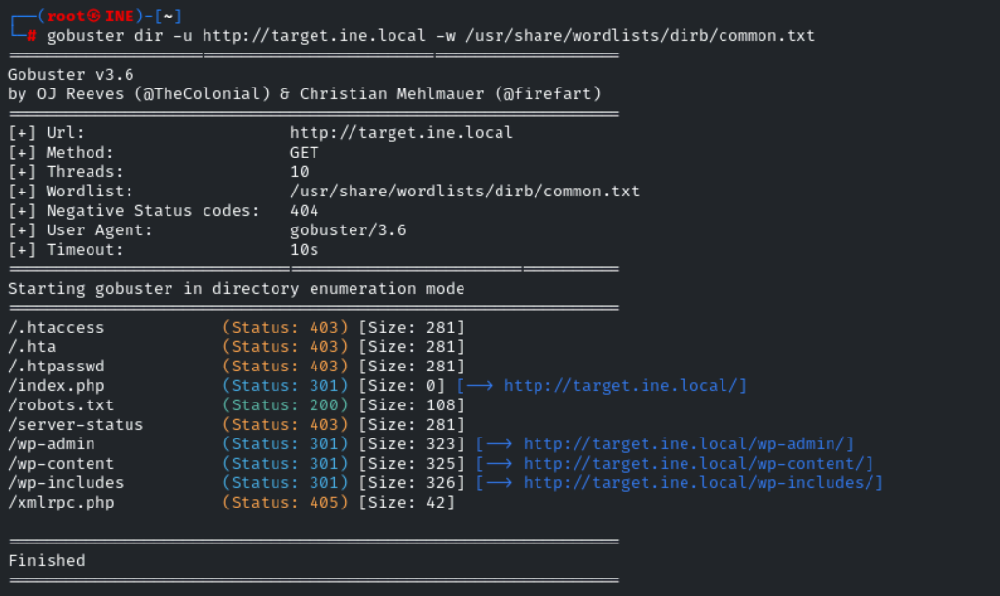

Lab Environment
A website is accessible at http://target.ine.local. Perform reconnaissance and capture the following flags.

Flag 1: This tells search engines what to and what not to avoid.

Flag 2: What website is running on the target, and what is its version?

Flag 3: Directory browsing might reveal where files are stored.

Flag 4: An overlooked backup file in the webroot can be problematic if it reveals sensitive configuration details.

Flag 5: Certain files may reveal something interesting when mirrored.

Tools
Firefox
Curl
HTTrack

Flag 1: This tells search engines what to and what not to avoid.

go to the robots.txt which is a text file placed in a website's root directory that tells search engine crawlers and 
web bots which pages or sections of the site they are allowed to visit

Flag 2: What website is running on the target, and what is its version?

using whatweb to identify website technologies and server details

Flag 3: Directory browsing might reveal where files are stored.

Web directory enumeration using gobuster

Flag 4: An overlooked backup file in the webroot can be problematic if it reveals sensitive configuration details.

Subdomain directory enumeration using gobuster

Flag 5: Certain files may reveal something interesting when mirrored.
 use HTTRACK and it automatically "mirrors" the site, copying all HTML code, images, and files while rewriting the links so you can browse locally just like you do online

